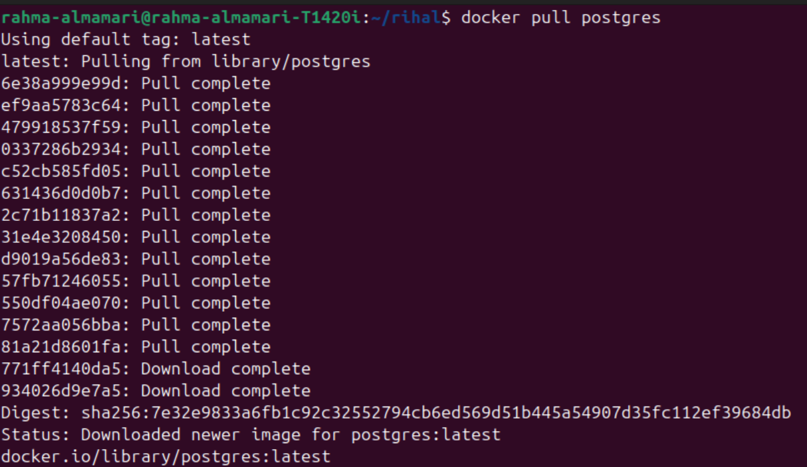

# PostgreSQL as Container in Docker

## Steps to Run PostgreSQL as Container in Docker

**1. Pull PostgreSQL Image**

```bash
docker pull postgres
```



**2. Create PostgreSQL Container With DB Inside it and Run the Container**

```bash
docker run --name postgres-course \
-e POSTGRES_USER=postgres \
-e POSTGRES_PASSWORD=postgres \
-e POSTGRES_DB=course_db \
-p 5432:5432 \
-d postgres
```

This command will create and start a new PostgreSQL container with yhe given settings.
explaining the commend line by line:

1. `docker run` -> This tells Docker: Create a new container from an image and start it.
2. `--name postgres-course` -> this will gives our container a custom name and if we do not do this docker generates random name.
3. `-e` -> it means environment variable.
4. `POSTGRES_USER=postgres` -> This creates the PostgreSQL username.
5. `POSTGRES_PASSWORD=postgres` -> This sets the password for the database user.
6. `POSTGRES_DB=course_db` -> This will automatically creates a database when the container starts.
7. `-p 5432:5432` -> This maps ports: (your computer : docker container).
8. `-d` -> This means detached mode which will runs the container in the background.
9. `postgres` -> This is the image name used to create this container (our image name is postgres:latest).

~~NOTE:~~ 

1. With this option, you can manage the container easily:

```bash
docker start postgres-course
docker stop postgres-course
docker logs postgres-course
```

2. PostgreSQL Docker images REQUIRE a password.

**3. Connect to DB course_db**

```bash
docker exec -it postgres-course psql -U postgres -d course_db
```

1. `docker exec` -> run command inside container.
2. `-it` -> interactive terminal.
3. `postgres-course` -> container name.
4. `psql` -> PostgreSQL CLI tool.
5. `-U postgres` ->  database user.
6. `-d course_db` -> database name.

~~NOTE:~~ disconnect by typing `\q` and click enter.


[Back to read me](README.md)