# Aggregation of Records

**THis section contain the following lessons:**

## 1. Aggregating and Grouping

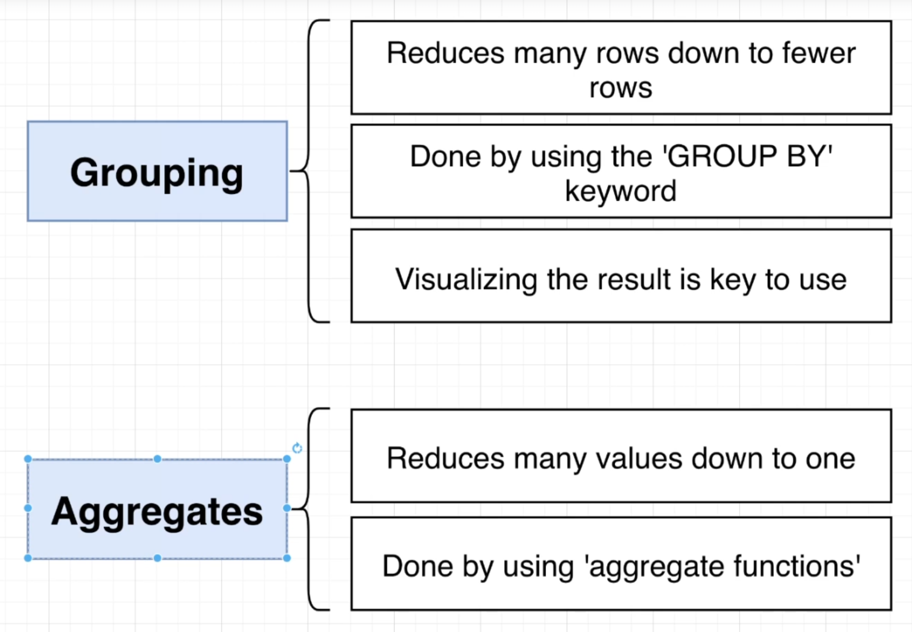

**Grouping**

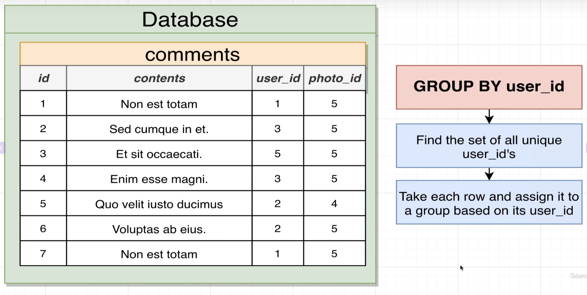

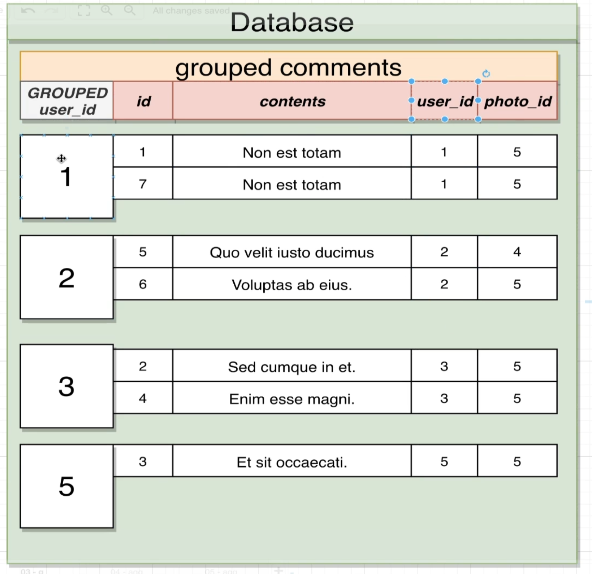

**~~NOTE:~~** when we use grouping we will not be able to select any oraginal columns without aggregation the only column we can select without aggregation is the column we used for grouping.

**Aggregation**

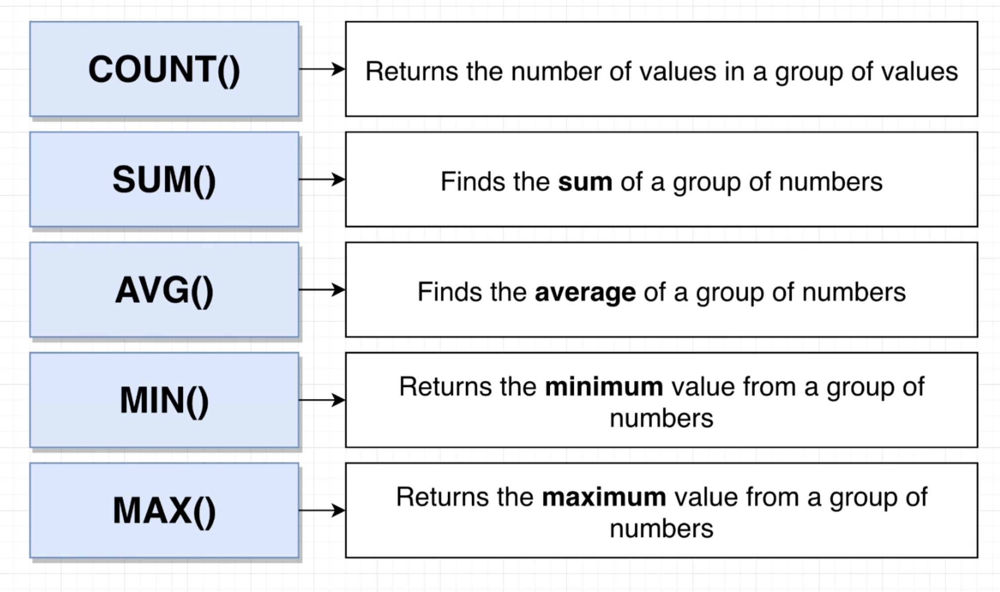

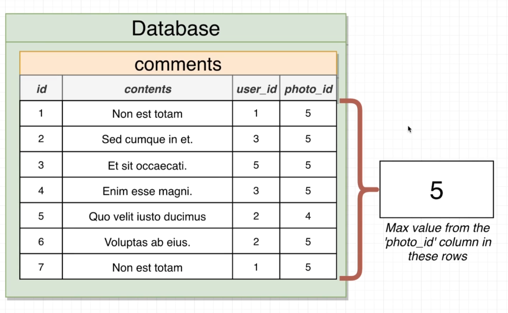

**~~NOTE:~~** when we use aggregation we will not be able to select any oraginal columns without grouping the only column we can select without grouping is the column we used for aggregation.

**Grouping with Aggregation**

**Example Oen:**
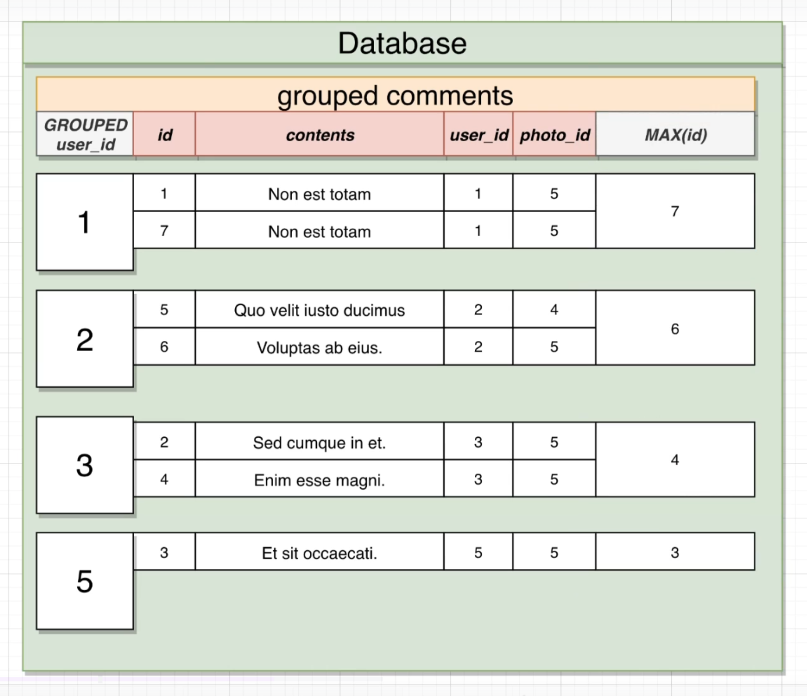

```sql

SELECT user_id, MAX(id)
FROM comments
GROUP BY user_id;

```


**Example Two:**

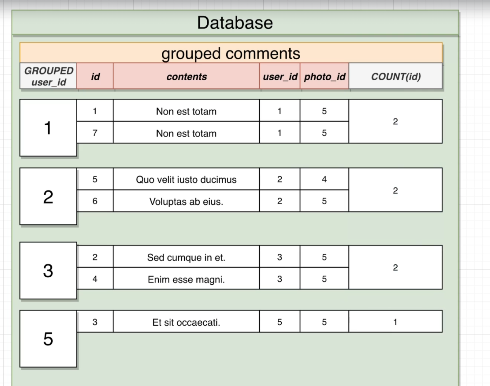

```sql

SELECT user_id, COUNT(id) AS number_of_comment
FROM comments
GROUP BY user_id;

```

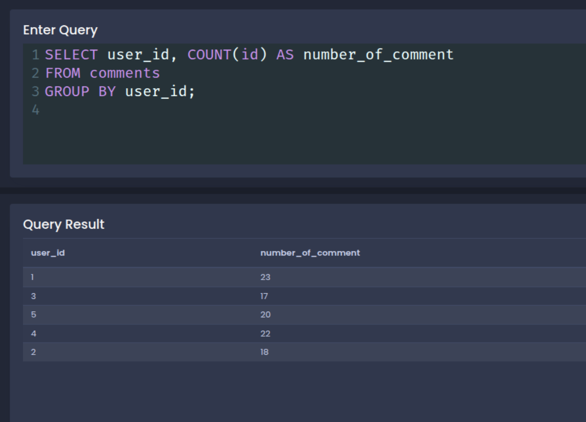

**~~NOTE:~~** `count()` do not count null values so if some row have null value in the column we aply `count()` on that row will not be included unless we do `count(*)` ... `count(*)` count all value of coulmn even the null.

**Example Three:**

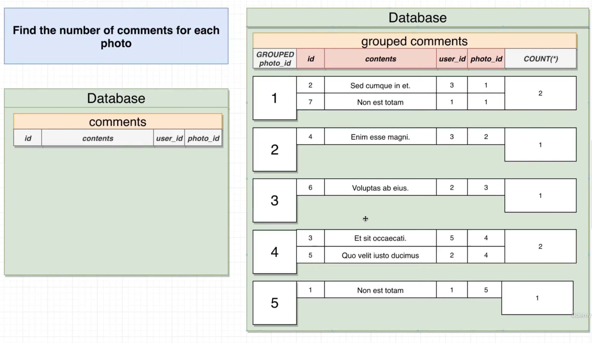

```sql

SELECT photo_id, COUNT(*) AS number_of_comment
FROM comments
GROUP BY photo_id;

```

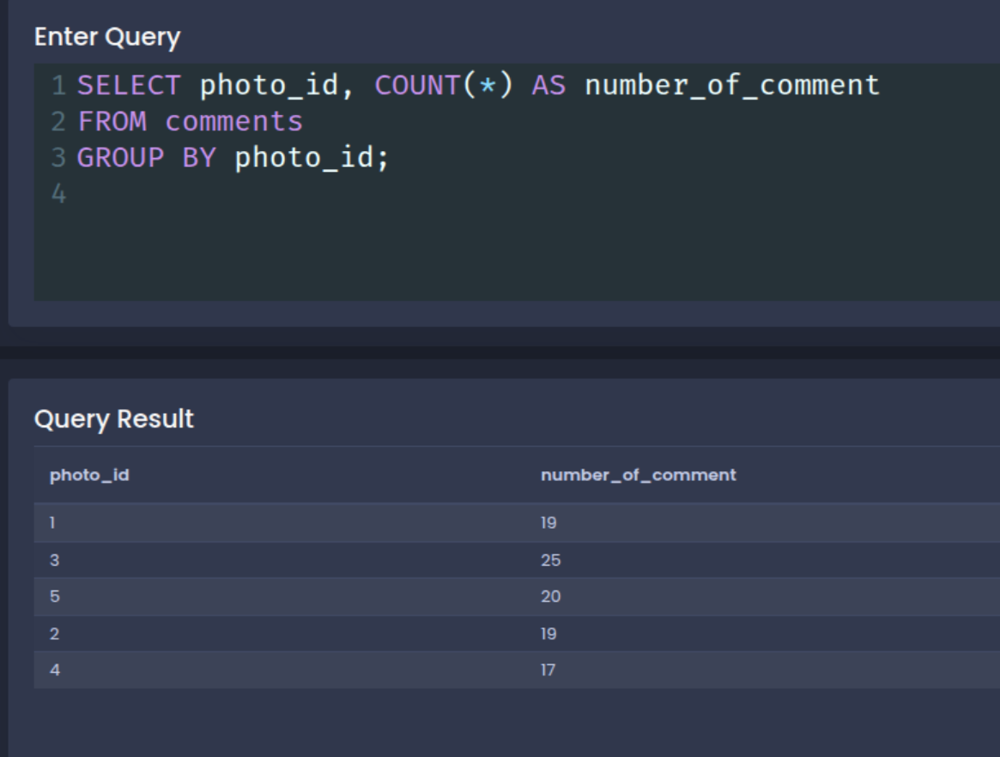


## 2. Filtering Groups with Having

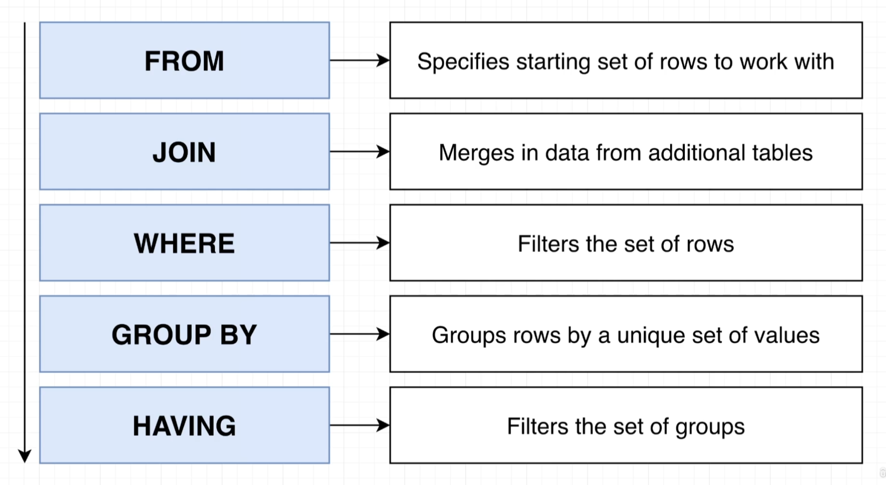

**~~NOTE:~~**
1. We use having to fillter the groups so if we do not use **GROUP BY** key word we can not use having and having alwasy come after group by.

2. if we do just filltering this mean we need to use **WHERE** but if we want to do filltering with aggreation function that mean we will use **HAVING**

**Example One:**

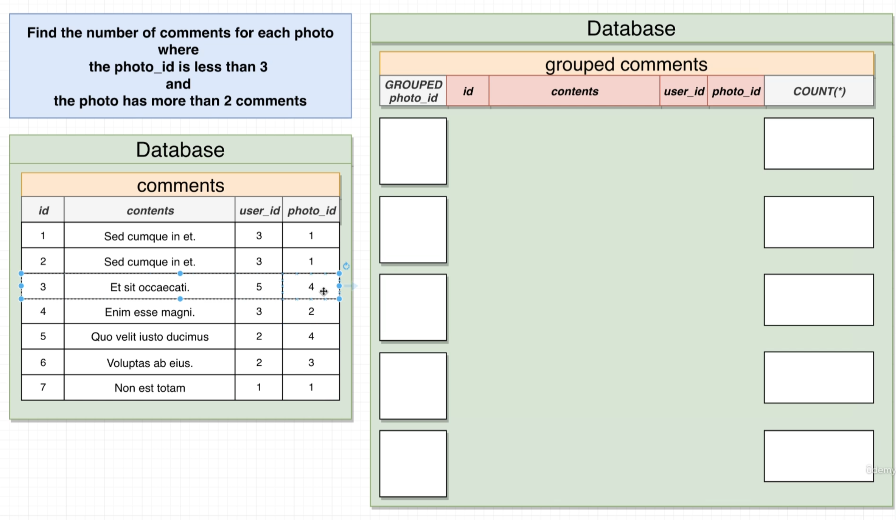

```sql

SELECT photo_id, COUNT(*) AS number_of_comments
FROM comments
WHERE photo_id < 3
GROUP BY photo_id 
HAVING COUNT(*) > 2;

```

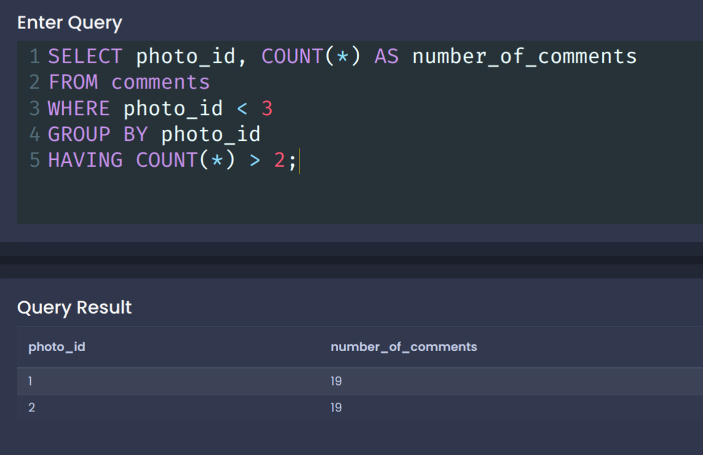

**Example Two:**

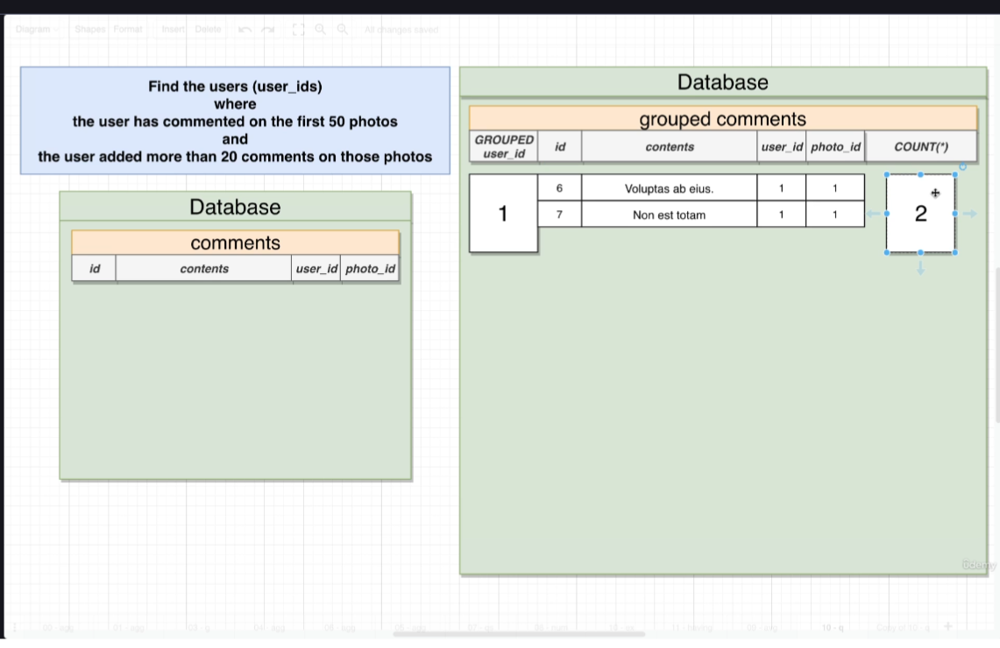

```sql

SELECT user_id, COUNT(*) AS number_of_comments
FROM comments
WHERE photo_id BETWEEN 1 AND 50
GROUP BY user_id 
HAVING COUNT(*) > 20;

```

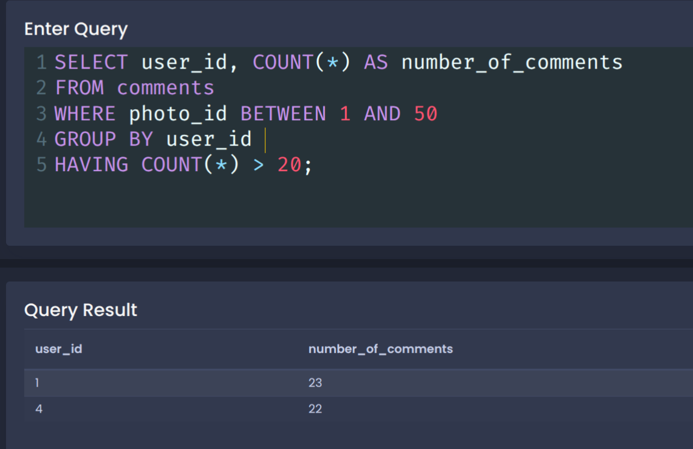


[Back to read me](README.md)