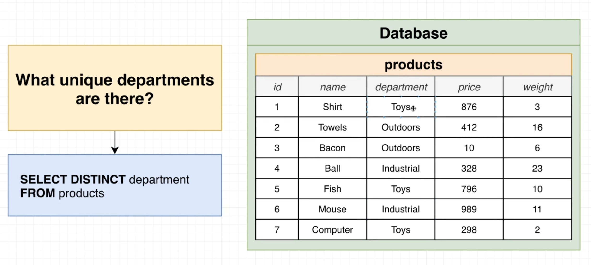
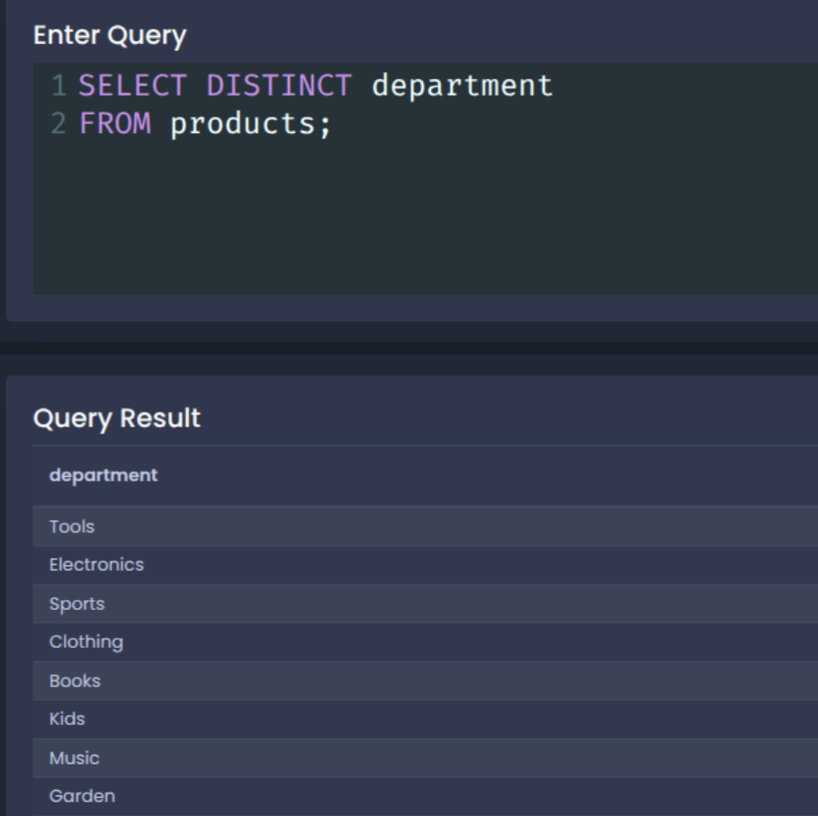
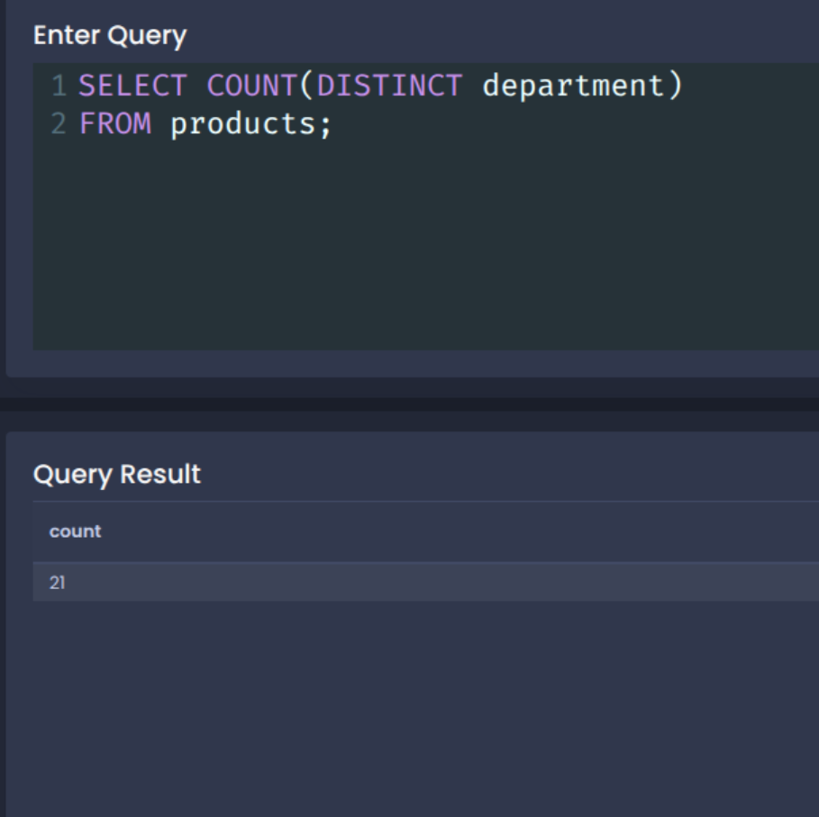
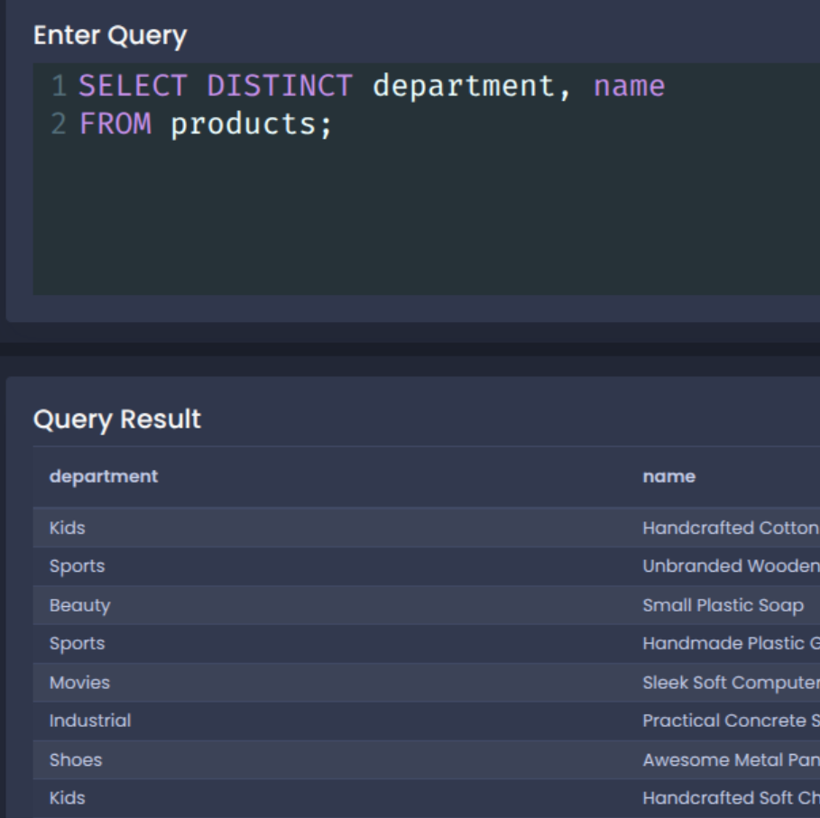

# Selecting Distinct Records

**~~NOTE:~~** this section use the following DB:

[SQL_DB](./sql/001+-+sq+-+data.sql)

## 1. Selecting Distinct Values



```sql 

SELECT DISTINCT department
FROM products;

```



```sql

SELECT COUNT(DISTINCT department)
FROM products;

```



```sql

SELECT DISTINCT department, name
FROM products;

```



