# Simple - But Powerful - SQL Statements

**THis section contain the following lessons:**

## 1. What is PostgreSQL All About?

A **database** is an organized collection of data that is stored and managed so it can be easily accessed, updated, and analyzed.

**SQL** stands for Structured Query Language.
It’s the language used to communicate with a database.

**📌 Simple idea**
If a database is like a storage system, then SQL is the way you talk to it.

You use SQL to:

- Get data
- Add data
- Update data
- Delete data

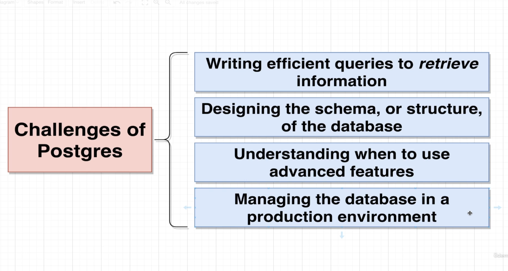

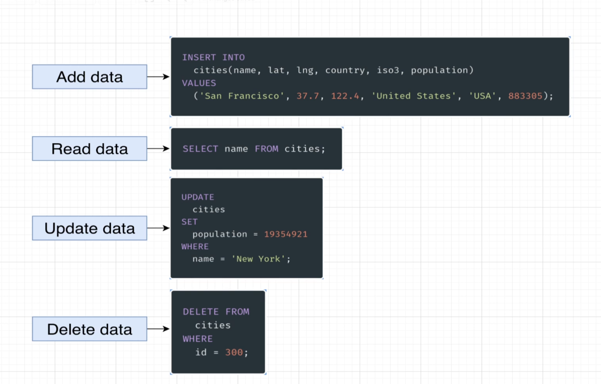

**PostgreSQL** (often called Postgres) is a powerful open-source relational database system used to store, manage, and query data.

**🧠 Think of it like this**

PostgreSQL is like a smart data engine:

- It stores your data (tables, rows, columns)
- It understands SQL commands
- It ensures your data is safe, consistent, and fast

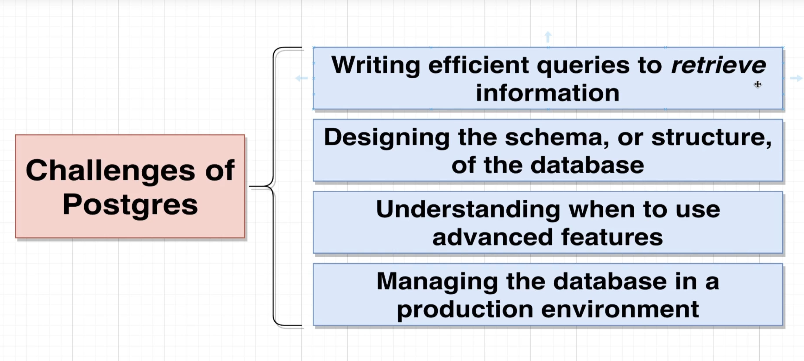


## 2. Database Design

Here we will try to design a database which contain one table called **cities**.

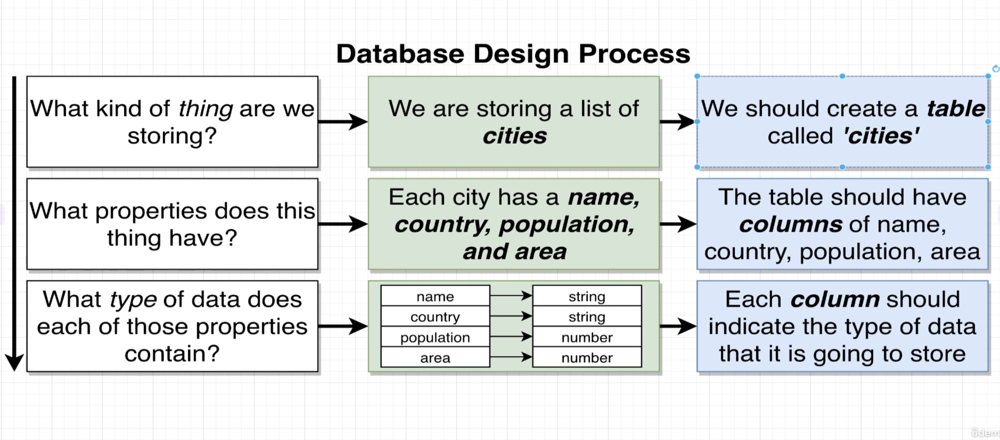

**Table** is a collection of records.
**Columns** each column will store some information about the properties.
**Rows** is the list of records inside the table.


## 3. Creating Tables

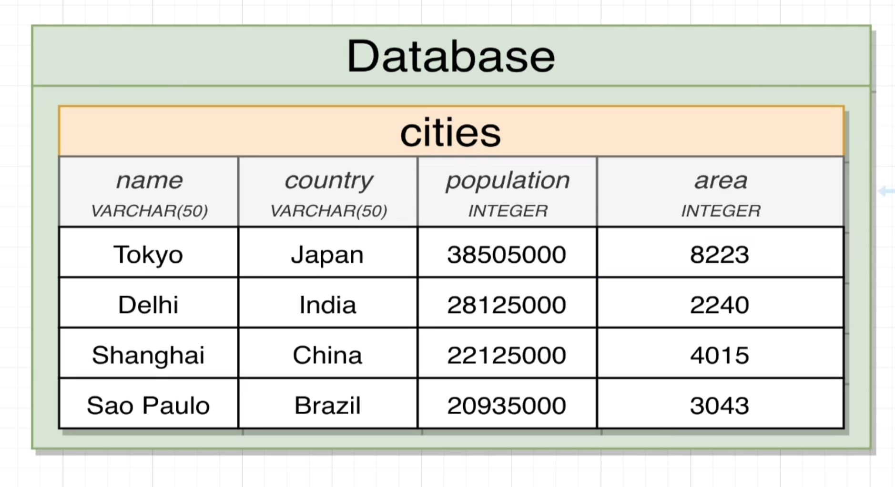

```sql

CREATE TABLE cities (
  name VARCHAR(50),
  country VARCHAR(50),
  population INTEGER,
  area INTEGER
);

```


## 4. Analyzing CREATE TABLE

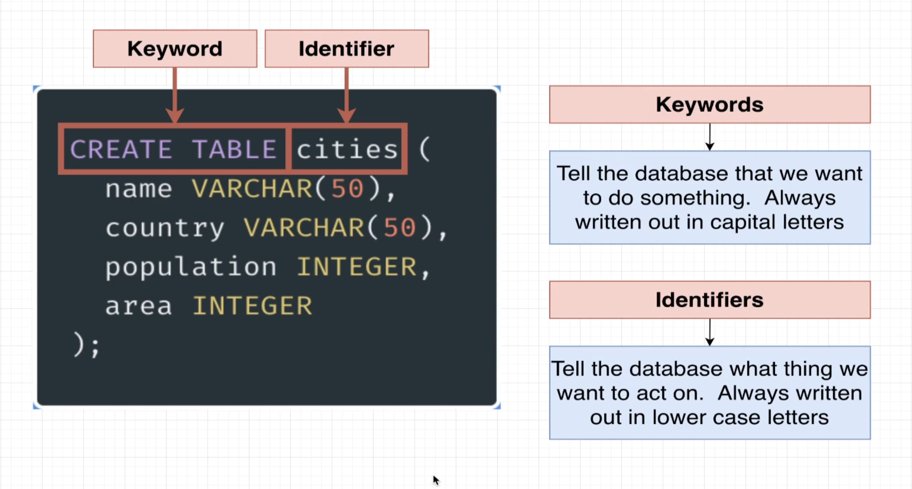


## 5. Inserting Data Into a Table

```sql

INSERT INTO cities (name, country, population, area)
VALUES 
  ('Tokoy', 'Japan', 38505000, 8223),
  ('Delhi', 'India', 28125000, 2240),
  ('Shanghai', 'China', 2212500, 4015),
  ('Sao Paulo', 'Brazil', 20935000, 3043);

```


## 6. Retrieving Data with Select

- Select all records in table.

```sql

SELECT * FROM cities;

```

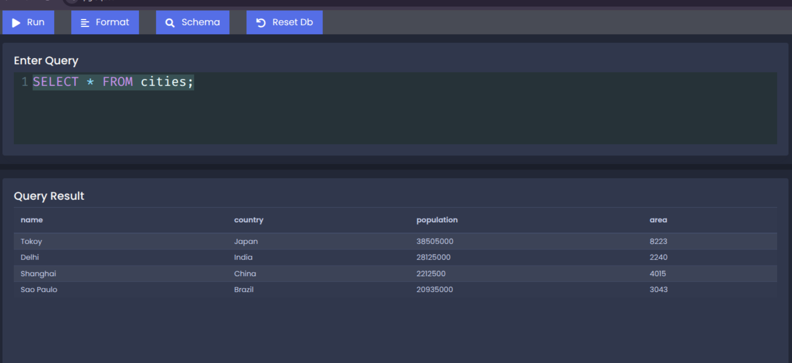

- Select some columns.

``` sql

SELECT name, country FROM cities;

```

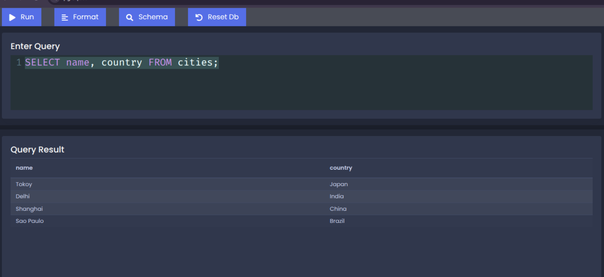


## 7. Calculated Columns

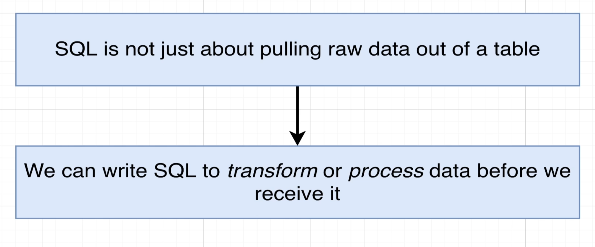

**Examlpe:**

```sql

SELECT name, population / area AS population_density
FROM cities;

```

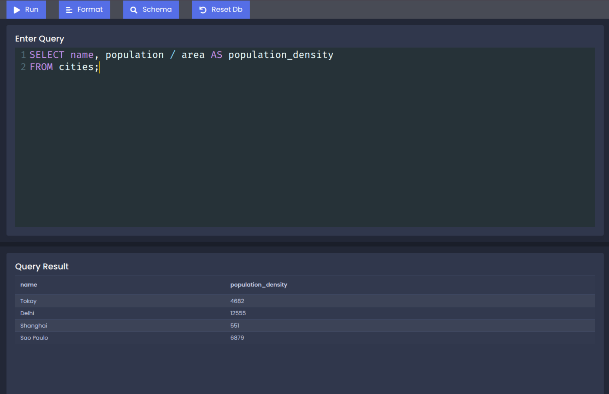

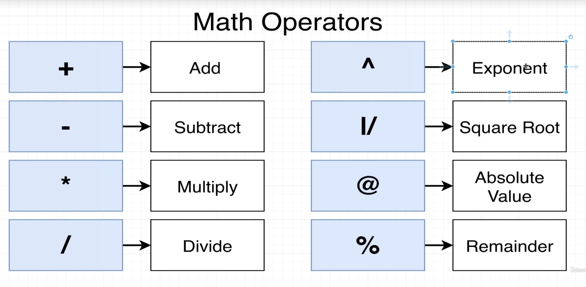


## 8. String Operators and Functions

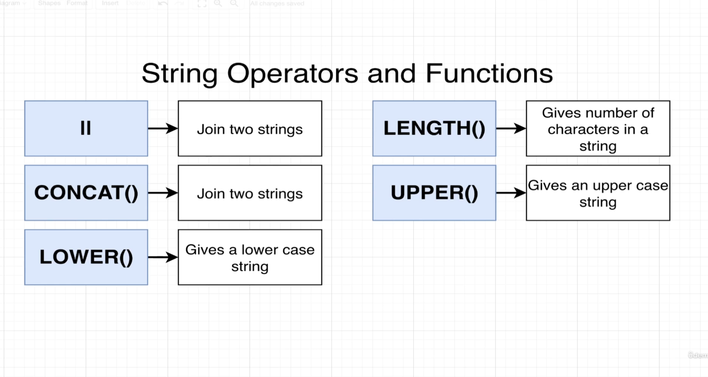

```sql

SELECT name || ', ' ||country As Location
FROM cities;

```

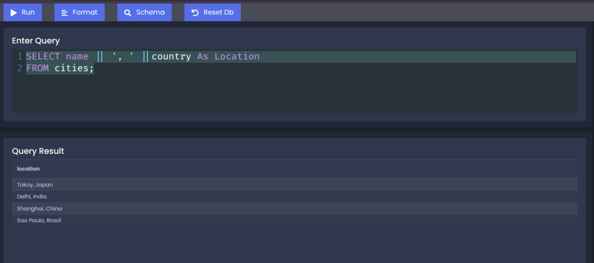

```sql

SELECT CONCAT(name, ', ', country) As Location
FROM cities;

```

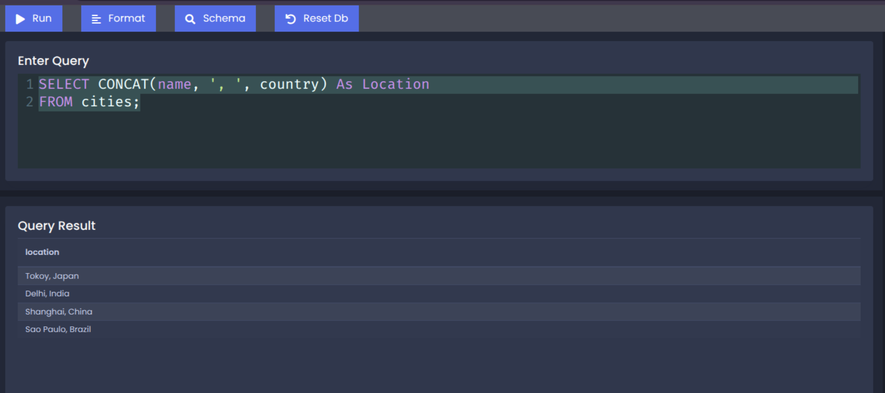

```sql

SELECT UPPER(CONCAT(name, ', ', country)) As Location
FROM cities;

```

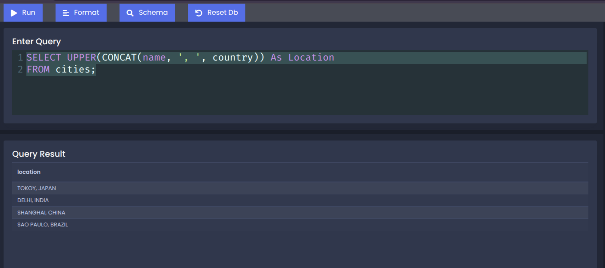

[Back to read me](README.md)