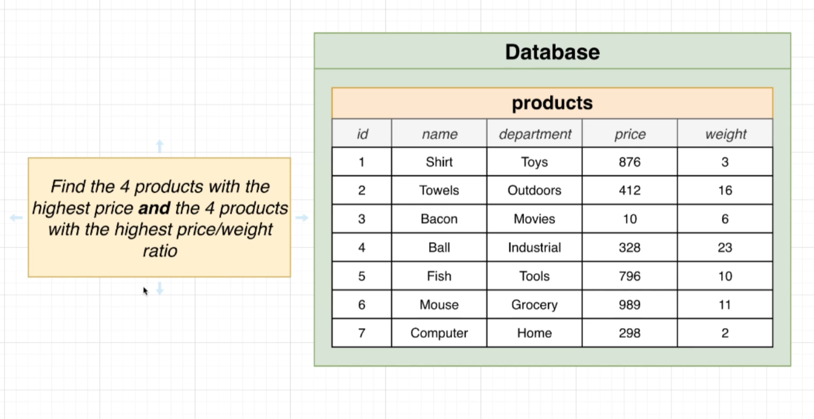
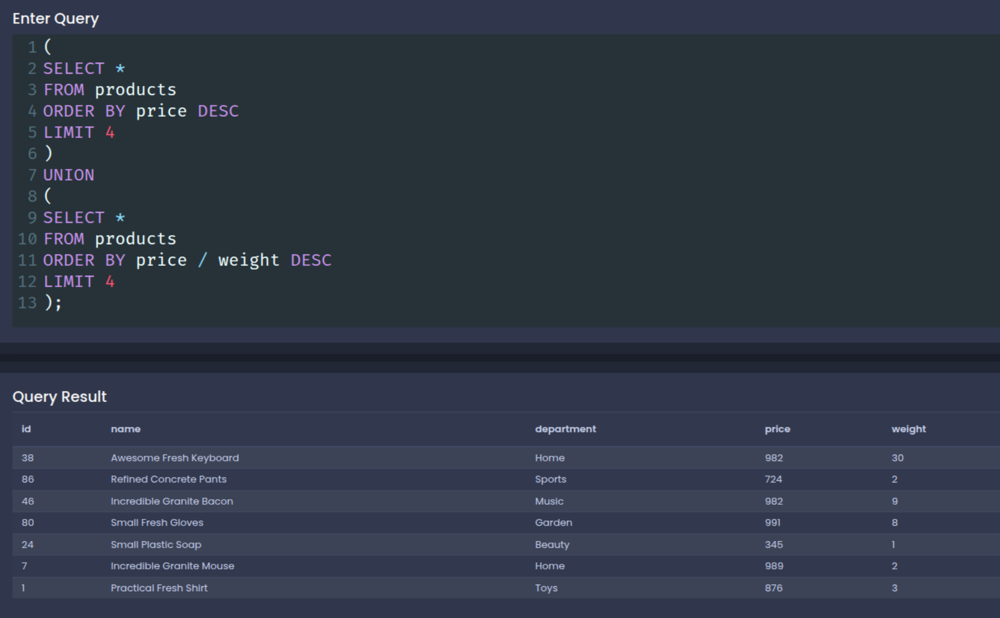
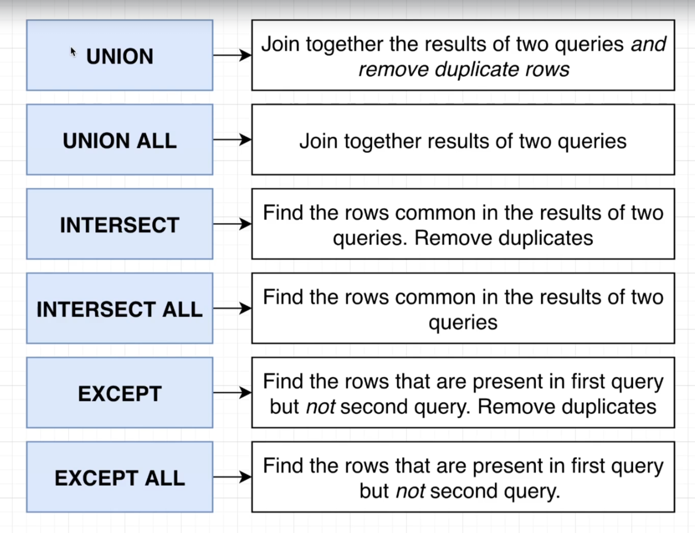
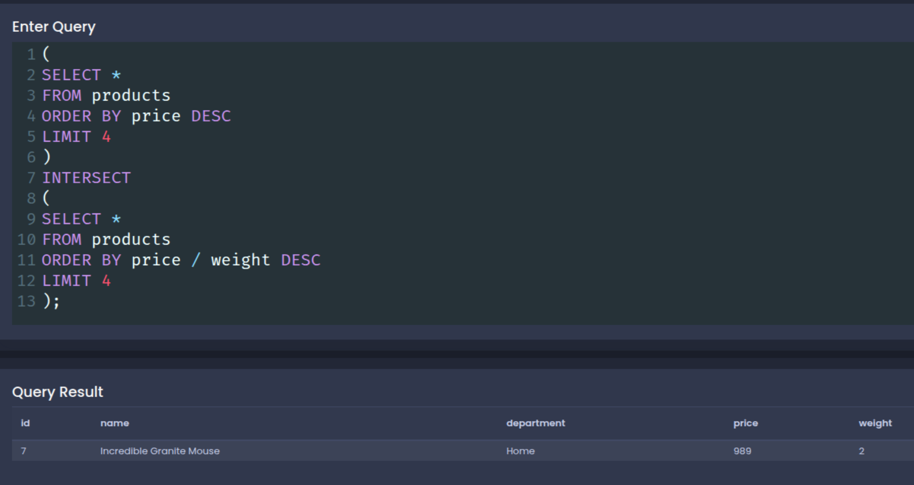
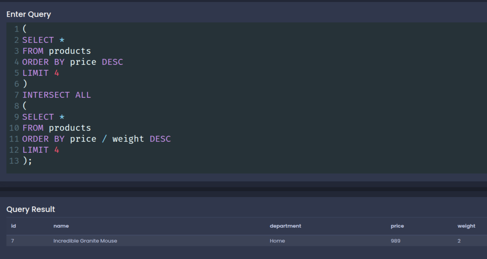
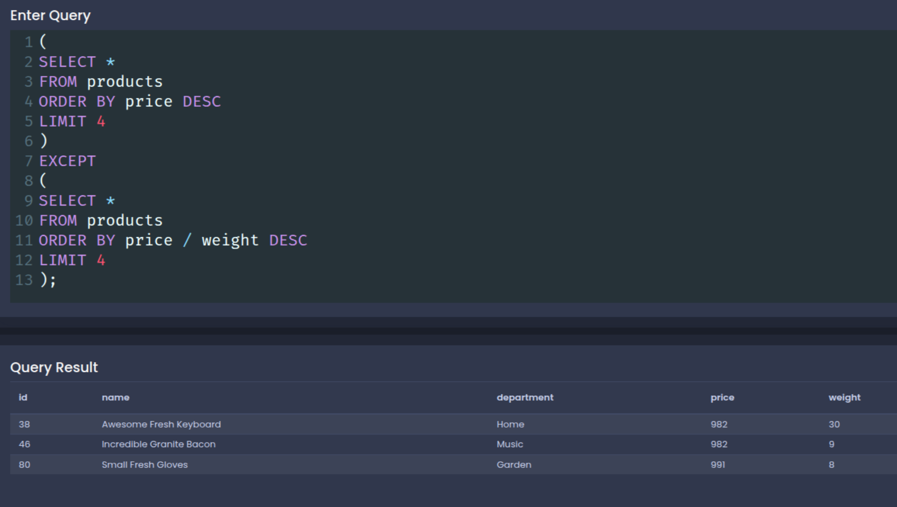

# Unions and Intersections with Sets

**~~NOTE:~~** this section use the following DB:

[SQL_DB](./sql/001+-+sq+-+data.sql)

**THis section contain the following lessons:**

## 1. Handling Sets with Union

**Union** key word compain the result of two diffrent queries to one 

**Example One:**



```sql

(
SELECT *
FROM products
ORDER BY price DESC
LIMIT 4
)
UNION
(
SELECT *
FROM products
ORDER BY price / weight DESC
LIMIT 4
);

```



**~~NOTE:~~** **Union** key word do not repet the row if it the same in the two queries result _show row without duplicate_ so we can use **Union All** key word if we want to show all the row even if it is duplicate.

```sql 

(
SELECT *
FROM products
ORDER BY price DESC
LIMIT 4
)
UNION ALL
(
SELECT *
FROM products
ORDER BY price / weight DESC
LIMIT 4
);

```


**~~NOTE:~~** to do **UNION** we need to have the same columns name with the same data type.

## 2. Commonalities with Intersect



**Intersect Example:**

_Intersect_ mean give me all commen row between the result of the two queries.

```sql 

(
SELECT *
FROM products
ORDER BY price DESC
LIMIT 4
)
INTERSECT
(
SELECT *
FROM products
ORDER BY price / weight DESC
LIMIT 4
);

```



**~~NOTE:~~** intersect give the row without duplicate.

```sql

(
SELECT *
FROM products
ORDER BY price DESC
LIMIT 4
)
INTERSECT ALL
(
SELECT *
FROM products
ORDER BY price / weight DESC
LIMIT 4
);

```



**~~NOTE:~~** intersect all give the row with duplicate.

**Except Example:**

Except it is show the row from the first query which is not in the set of result row of second query and for that the query ordre is so importent in Except.

```sql

(
SELECT *
FROM products
ORDER BY price DESC
LIMIT 4
)
EXCEPT
(
SELECT *
FROM products
ORDER BY price / weight DESC
LIMIT 4
);

```



 
