# Sorting Records

**~~NOTE:~~** this section use the following DB:

[SQL_DB](./sql/001+-+sq+-+data.sql)

**THis section contain the following lessons:**

## 1. The Basics of Sorting

**Sorting** works by using the key word **ORDER BY**.

_Example:_

```sql

SELECT * 
FROM products
ORDER BY price;

-- here sorting happen based on price

```

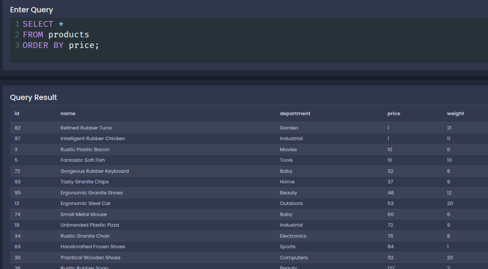

By defult sorting order the row from smole value to big value unless we use the key word **DESC** which will sorte the value from big to smole


```sql

SELECT * 
FROM products
ORDER BY price DESC;

-- here sorting happen based on price

```

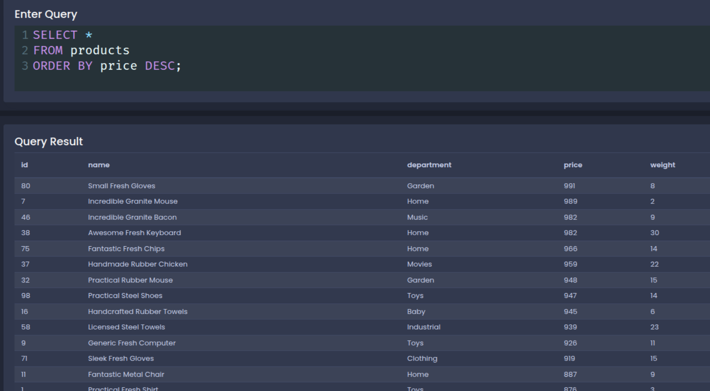


## 2. Two Variations on Sorting

**1. sorting using string** 

in this type of sorting we will sorte the value from A -> Z if it defult sorting or from Z -> A if it used **DESC**

```sql

SELECT * 
FROM products
ORDER BY name;

```

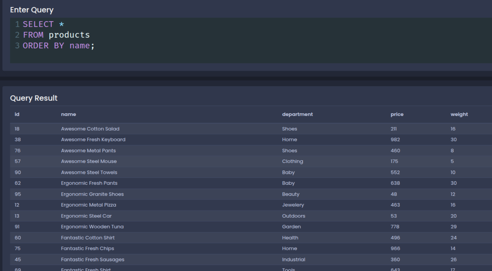


```sql

SELECT * 
FROM products
ORDER BY name DESC;

```

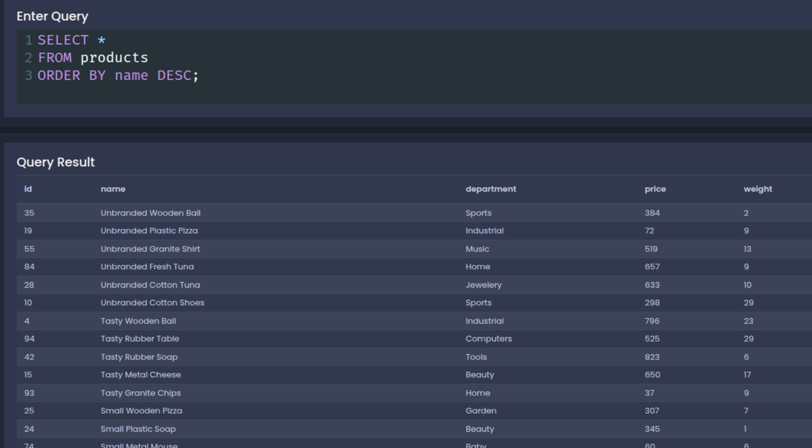

**2. sorting using more than one row**

```sql

SELECT * 
FROM products
ORDER BY price, weight;

```

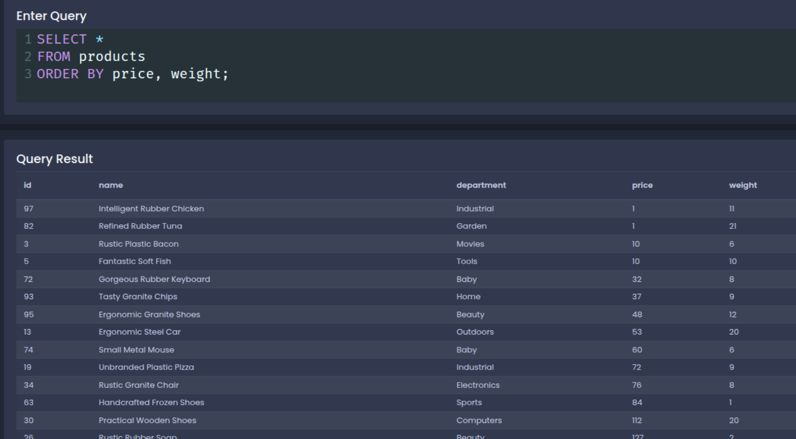

```sql

SELECT * 
FROM products
ORDER BY price, weight DESC;

```

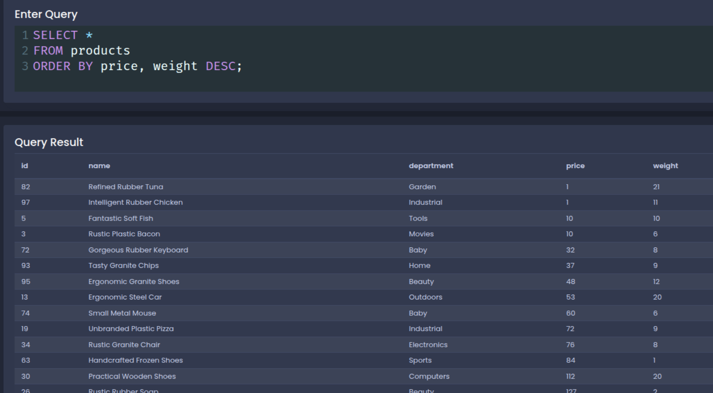

## 3. Offset and Limit

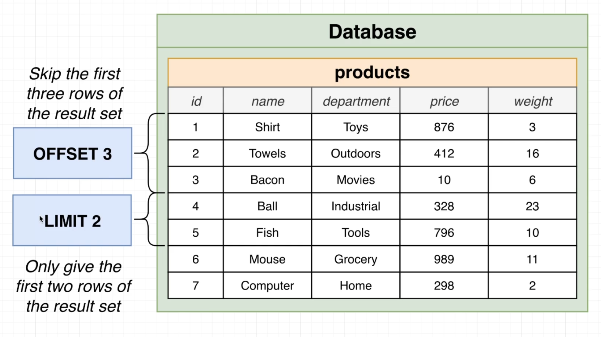

**Offset Example:**

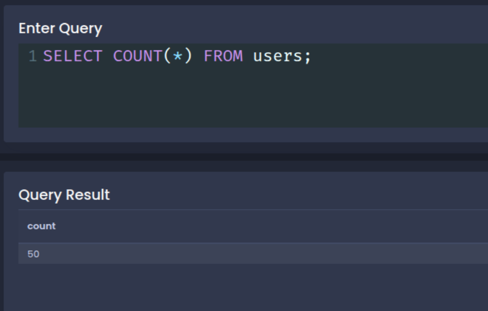

```sql

SELECT *
FROM users
OFFSET 40;

-- skip the first 40 row 

```

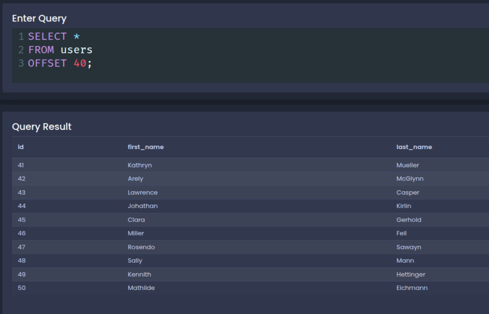

**Limit Example:**


```sql

SELECT *
FROM users
LIMIT 5;

-- print the first 5 row

```

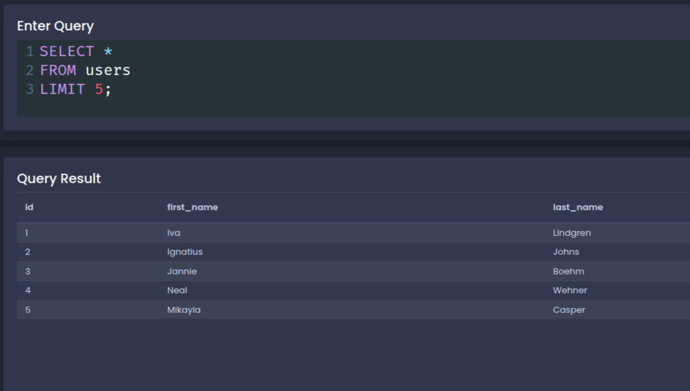

**Offset and Limit Example:**


```sql

SELECT *
FROM products
OFFSET 3
LIMIT 1;

```

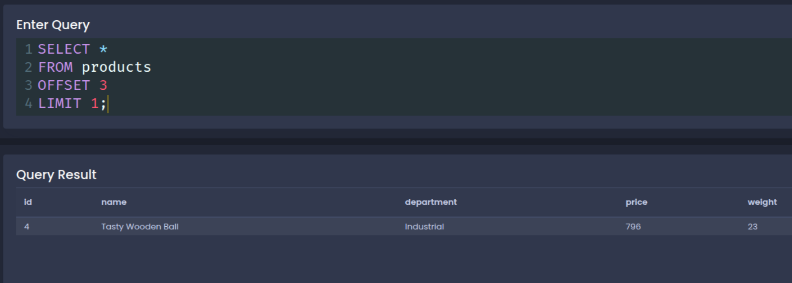

**~~NOTE:~~** the order between **offset** and **limit** is not importent so we can use offset first then limit or limit first then offset.


[Back to read me](README.md)

