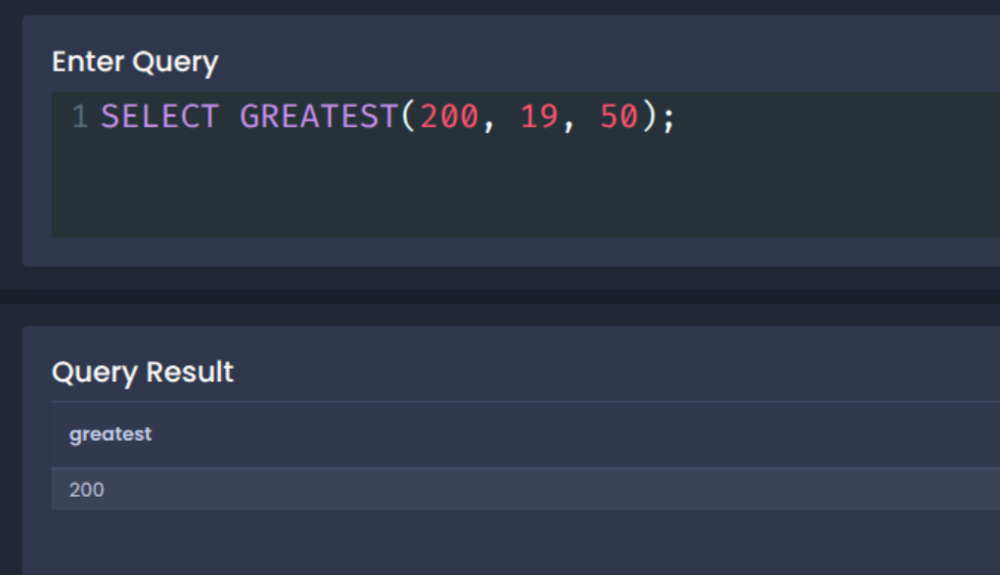
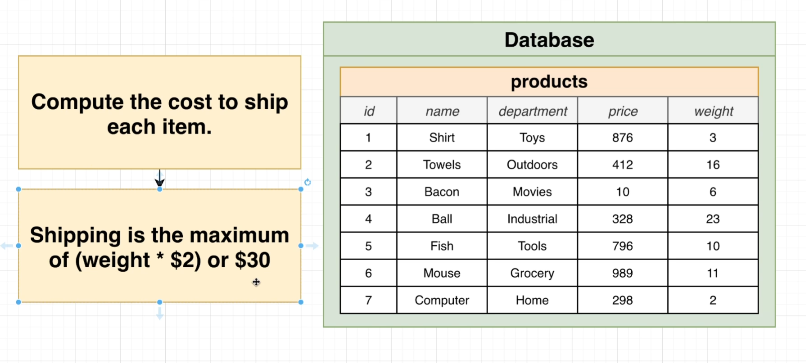
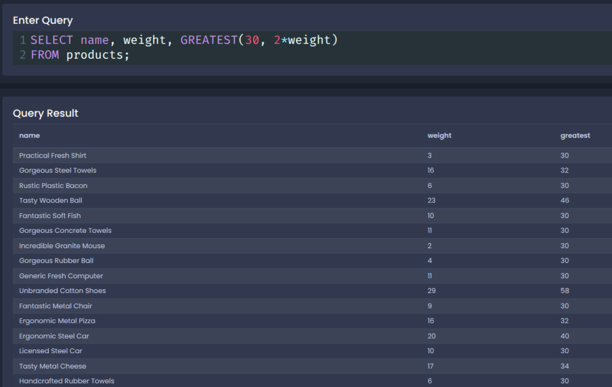
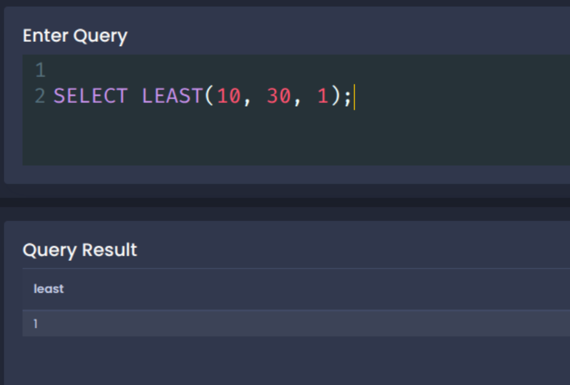
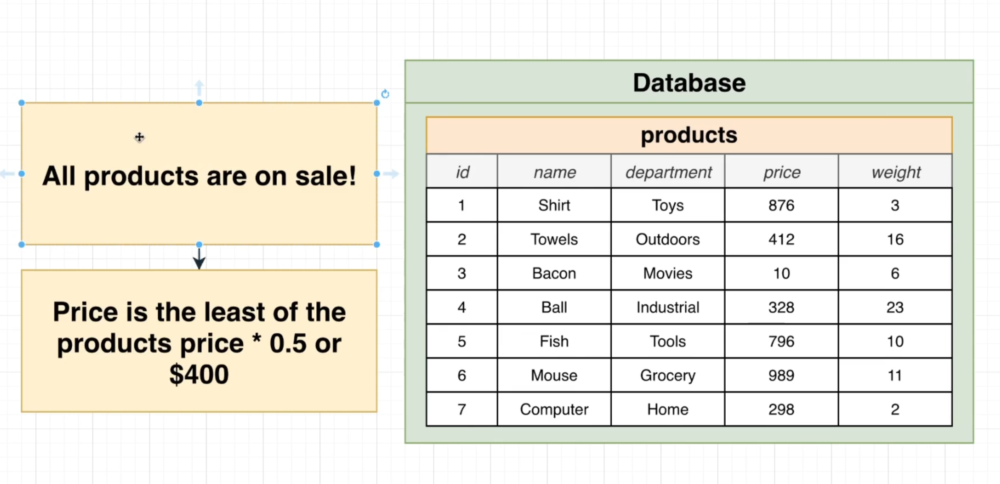
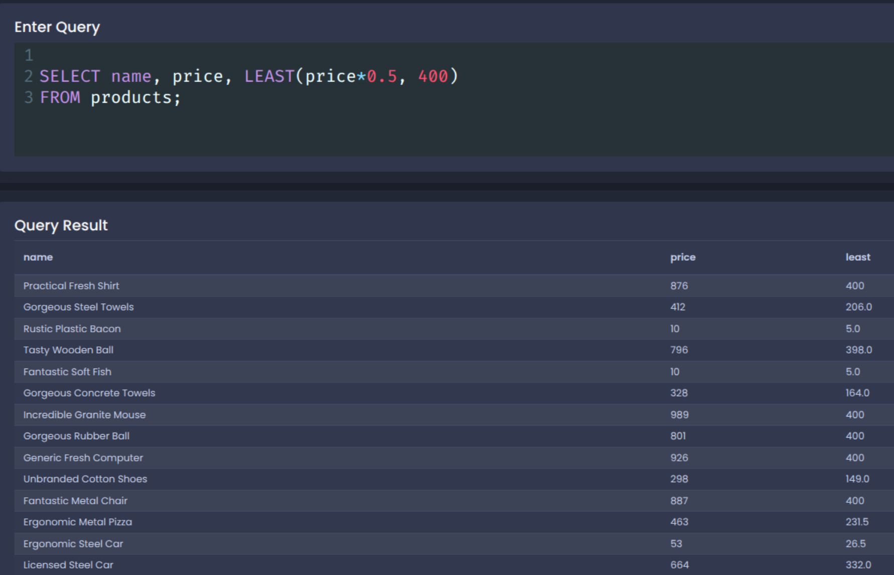
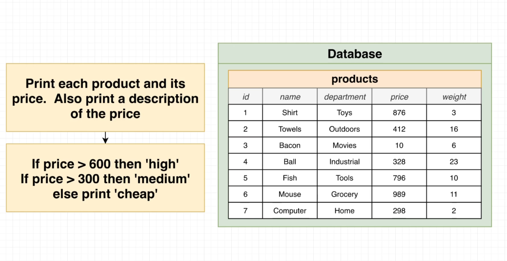
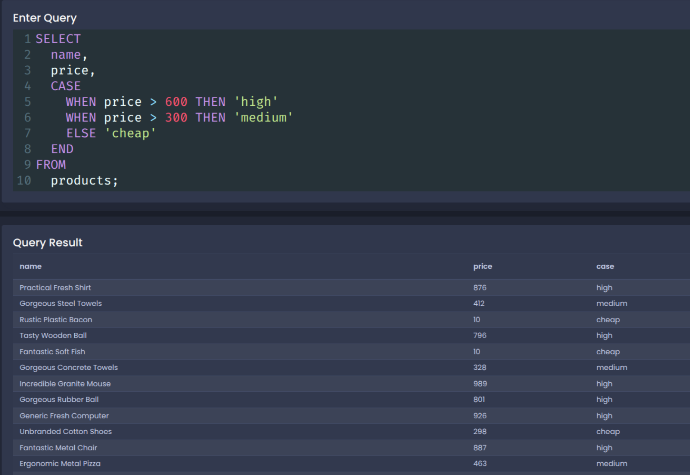

# Utility Operators, Keywords, and Functions

**~~NOTE:~~** this section use the following DB:

[SQL_DB](./sql/001+-+sq+-+data.sql)

**THis section contain the following lessons:**

## 1. The Greatest Value in a List

**the GREATEST() function returns the largest value from a list of expressions.**





```sql

SELECT name, weight, GREATEST(30, 2*weight)
FROM products;

```



## 2. The Least Value in a List!

**the LEAST() function returns the smallest value from a list of expressions.**





```sql

SELECT name, price, LEAST(price*0.5, 400)
FROM products;

```



## 3. The Case Keyword

**The CASE keyword in SQL is used to add conditional logic — similar to if-else in programming languages.**



```sql

SELECT
  name,
  price,
  CASE
    WHEN price > 600 THEN 'high'
    WHEN price > 300 THEN 'medium'
    ELSE 'cheap'
  END
FROM
  products;

```


