# Filtering Records

**THis section contain the following lessons:**

## 1. Filtering Rows with "Where"


```sql 

SELECT name, country
FROM cities
WHERE area > 4000;

```

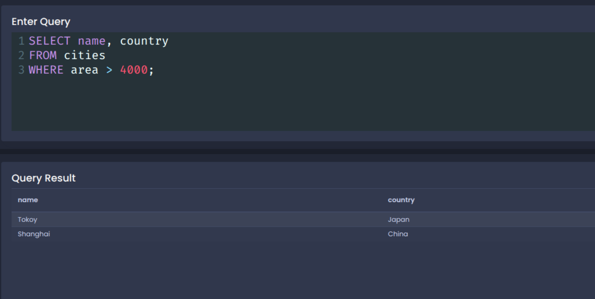

**The order SQL run query**

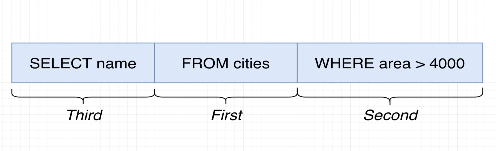

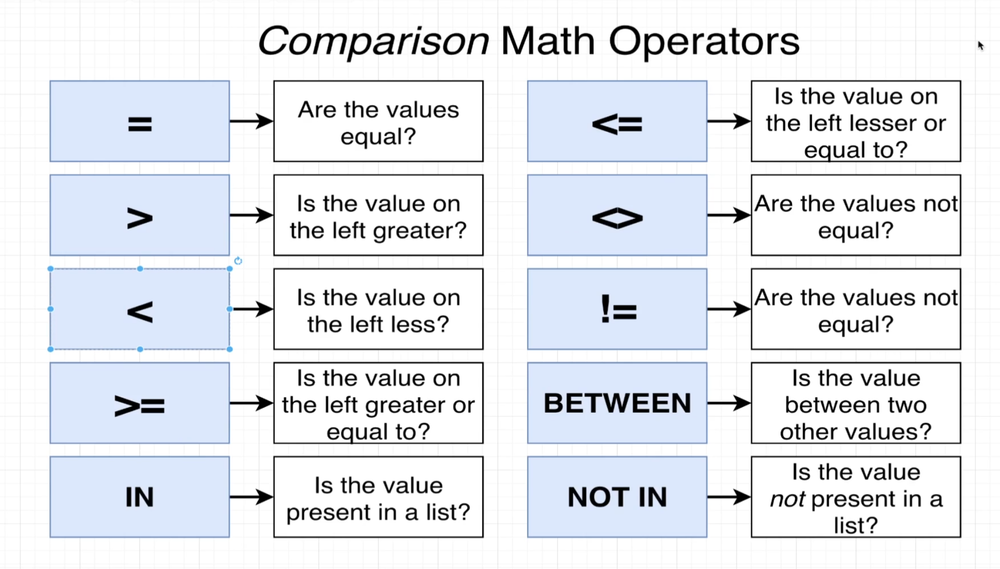

```sql

SELECT name, area
FROM cities
WHERE area = 8223;

```

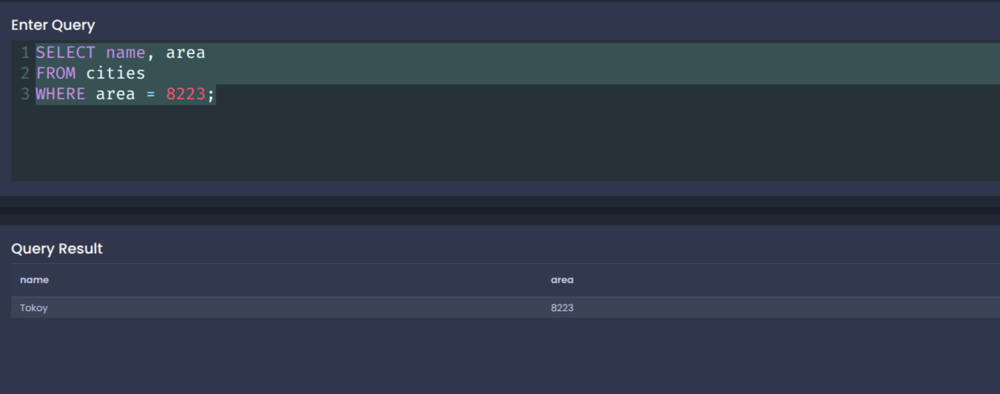

```sql

SELECT name, area
FROM cities
WHERE area != 8223;

```

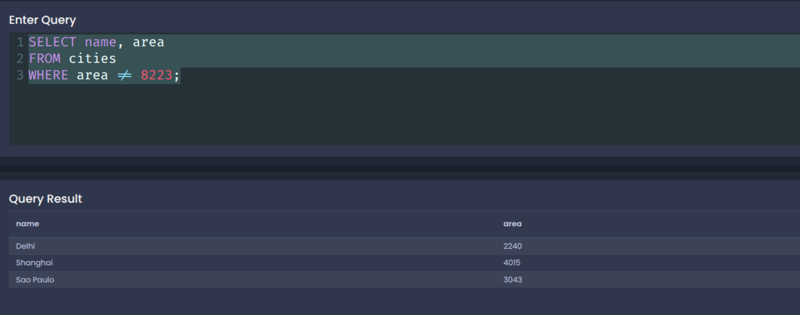

```sql

SELECT name, area
FROM cities
WHERE area BETWEEN 2000 AND 4000;

```

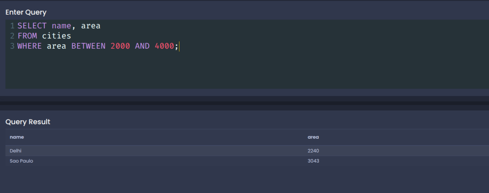

```sql

SELECT name, area
FROM cities
WHERE name IN ('Delhi', 'Shanghai');

```

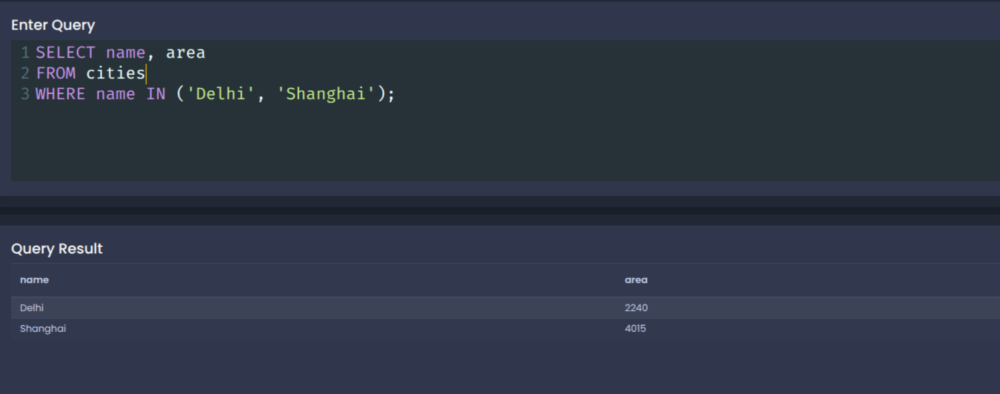

```sql

SELECT name, area
FROM cities
WHERE name NOT IN ('Delhi', 'Shanghai');

```

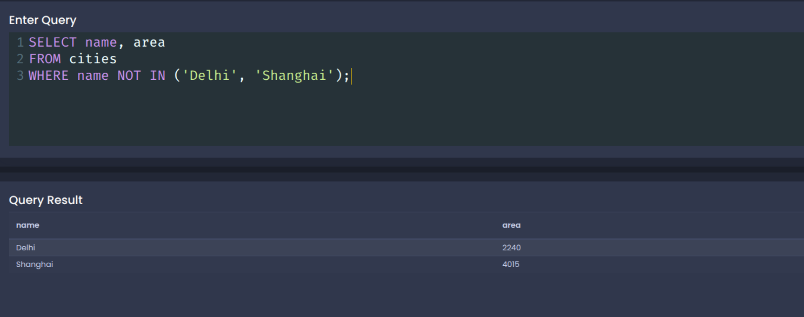

```sql

SELECT name, area
FROM cities
WHERE area NOT IN (3043, 8223) AND name = 'Delhi';

```

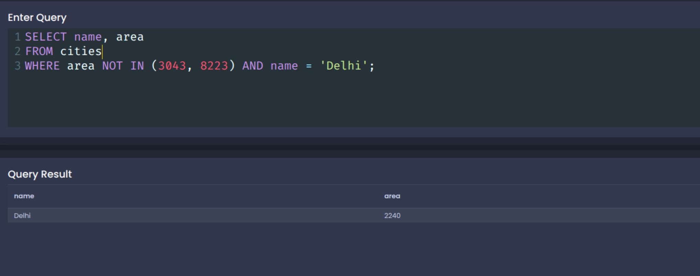

```sql

SELECT name, population / area AS population_density
FROM cities
WHERE population / area > 6000;

```

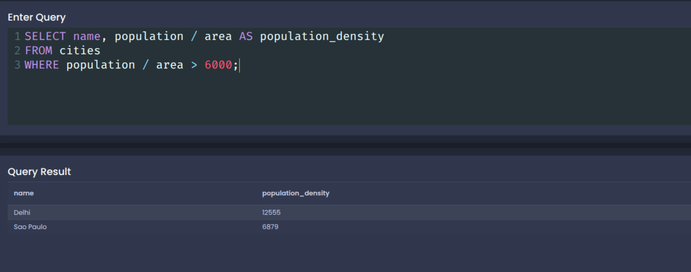


## 2. Updating Rows

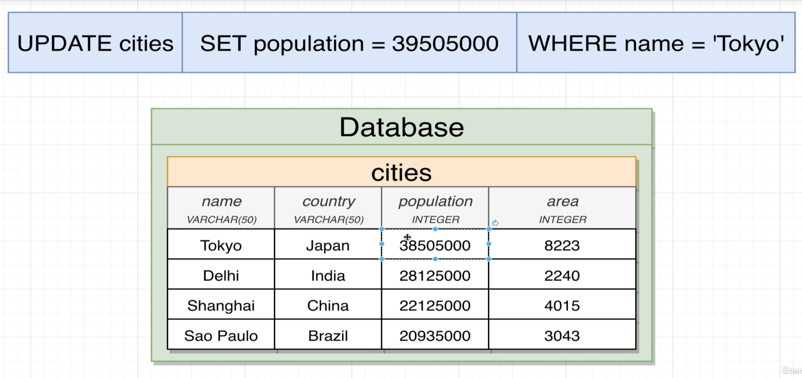

**Update Role:**

UPDATE tabble_name SET column_Name_to_update = new_value WHERE condation;

```sql

UPDATE cities 
SET population = 39505000
WHERE name = 'Tokyo';

```
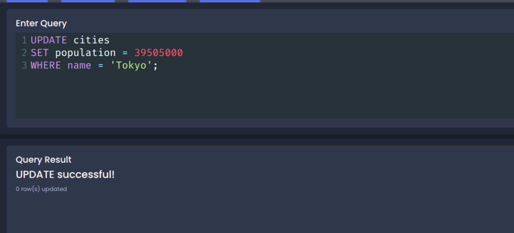


## 3. Deleting Rows

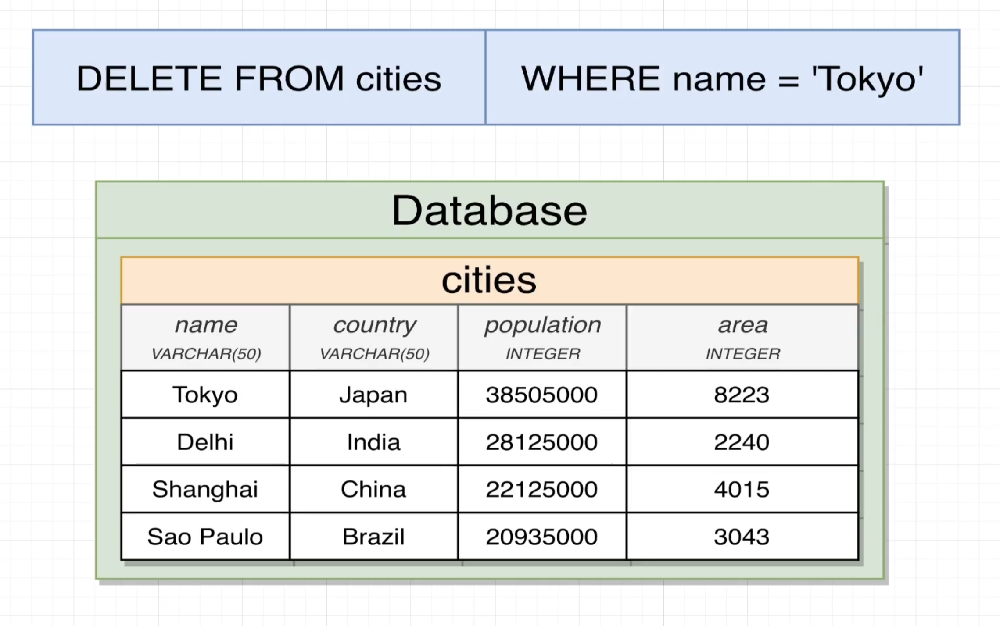

**Delete Role:**

DELETE FROM tabble_name WHERE condation;

```sql

DELETE FROM cities WHERE name = 'Tokyo';

```
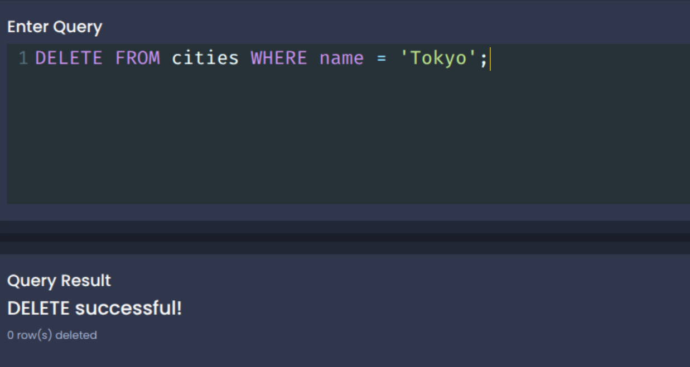


[Back to read me](README.md)
